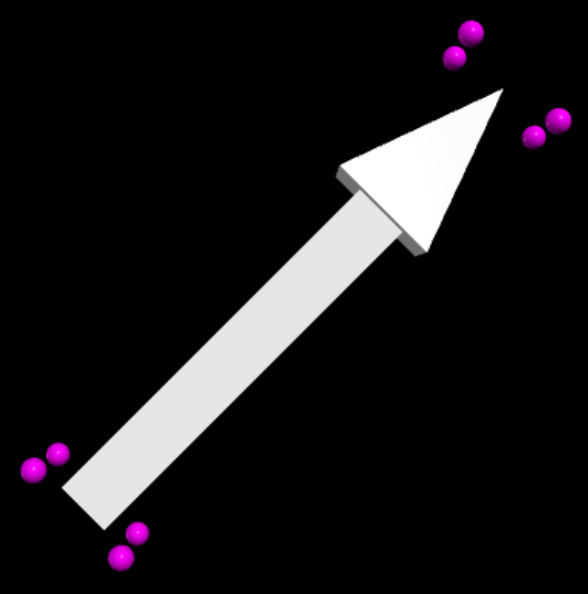

bounding_box()
==============
   :orphan:

*bounding_box()* is a method of most objects that returns a list of the locations of the corners of a box surrounding the object.  The following code places a sphere at each corner of the bounding box of an arrow:

.. code-block:: python

   myarrow = arrow(axis=vec(1,1,0))
   bb = myarrow.bounding_box()
   for pt in bb:
       sphere(pos=pt, radius=0.05, color=color.magenta)

*bounding_box* is not available for *curve*.  It works for compounds as long as the default position is used (as long as *origin* is not set).
