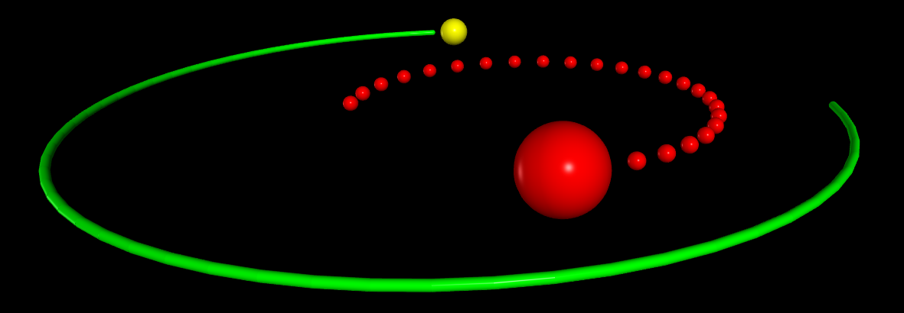

Leaving a Trail
===============

make_trail
----------

To leave a trail set ``make_trail=True`` for an object. Each time the scene is rendered, the new position *ball.pos* is added to a curve, thereby leaving a trail behind the moving object. This works with all objects, including compound objects, except for the curve and points objects.

.. py:function:: ball=sphere( make_trail=True, trail_type="points", trail_radius=0.2, interval=10, retain = 1000 )

   :param make_trail: If *True* a moving object will leave a trail. Default is False.
   :type make_trail: boolean
   :param trail_type: If "points" trail will consist of discrete dots.  Otherwise a continuous curve.
   :type trail_type: string
   :param trail_radius: Radius of curve or dots. Default 0 (thin curve) for curve; 0.2*ball.radius or 0.1*size.y for points *at the time the object is created.*
   :type trail_radius: scalar
   :param interval: Number of moves before a point is added. *interval=10* adds a point to trail every 10th time object moves.
   :type interval: scalar
   :param retain: Number of points to retain in trail. Default is to retain all.  Oldest points deleted first.
   :type retain: scalar
   :param pps: For a curve, *pps=15* will add a point approximately 15 times per second.
   :type pps: scalar

If at any time while the object is moving you set ``ball.make_trail=False``, no more points are added to the trail until you set ``ball.make_trail=True`` again, when a new trail will be started at the ball's current position.

If you specify an interval (greater than zero) and do not specify a position when creating the ball, the first point along the trail will occur when a position is later assigned to the ball. If you do specify a position when creating the ball, and make_trail is True, the first point along the trail is that specified position. If no interval is specified, the curve starts with whatever the position is at the time of the first rendering of the scene.

A caveat: If the trail's points are far apart, do not use a rate greater than rate(60). VPython attempts to render the 3D scene 60 times per second. Each time it renders the scene it looks through a list of all those objects that have specified "make_trail=True", and if an object's pos attribute has changed, the render function extends the trail. If you specify rate(300), and you update an object's position once in each pass through the loop, only every 5th position of the object will be added to the trail, because the scene is rendered only about 60 times per second. In contrast, if you specify rate(10) and you update an object's position once in each pass through the loop, the trail will be extended 10 times per second.

Clearing *make_trail*
^^^^^^^^^^^^^^^^^^^^^

**ball.clear_trail()** Clears all points from the existing trail before adding more.  To stop adding points set ball.make_trail to False.

